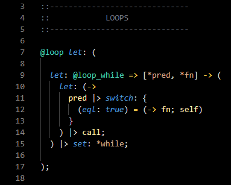
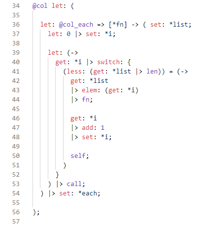

	

<i>
	Syntax for the relay scripting language

</i>

 

## Screenshots

 

theme: <a href="https://marketplace.visualstudio.com/items?itemName=rubyjasmin.hyperterm-theme">Hyper Term Theme</a>
 
 
 

theme: <a href="https://marketplace.visualstudio.com/items?itemName=wassimdev.windows-nt-vscode-theme">Windows NT</a>
 
